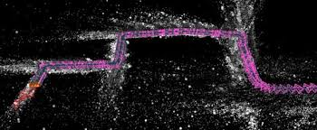
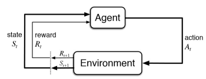
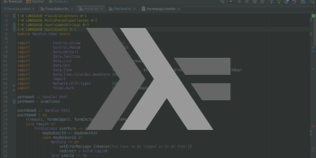
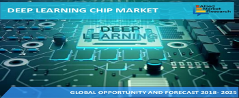
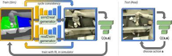
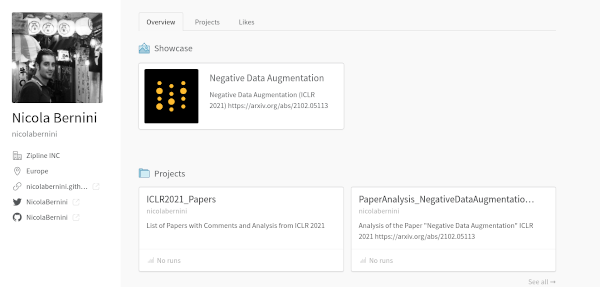

# Nicola Bernini 

My personal page 

[https://nicolabernini.github.io/](https://nicolabernini.github.io/) 

# Work Experience

Currently Sr. Perception Engineer @ [Zipline](https://flyzipline.com/)

Previously @ [Uber Elevate](https://www.uber.com/it/it/elevate/) and [Ambarella](https://www.ambarella.com/) working on Computer Vision and ML for Autonomous Vehicles, Embedded Deep Learning

Some of the things I have been working on

- at the intersection of Machine and Computer Vision on topics like SLAM, Visual Odometry, Object Detection, ... for Autonomous Vehicles (cars and flying drones)

- on Reinforcement Learning for Controller Synthesis and Properties Falsification 

- at the intersection of Programming Languages and Safety, exploring approaches like Transpiling

- Deep Learning on Embedded Platforms, with model compression, pruning and quantization, dealing with the SoCs architecture and on chip hardware accelerators 

- also a bit with GAN for Dataset Augmentation and Sim2Real

# Recent Posts 

You need to turn off tracking protection

## Blockchain

<iframe src="https://www.linkedin.com/embed/feed/update/urn:li:share:6807223556536066048" height="460" width="504" frameborder="0" allowfullscreen="" title="Embedded post"></iframe>

<iframe src="https://www.linkedin.com/embed/feed/update/urn:li:share:6806579221427703808" height="575" width="504" frameborder="0" allowfullscreen="" title="Embedded post"></iframe>

<iframe src="https://www.linkedin.com/embed/feed/update/urn:li:share:6804787409604116480" height="542" width="504" frameborder="0" allowfullscreen="" title="Embedded post"></iframe>

<iframe src="https://www.linkedin.com/embed/feed/update/urn:li:share:6804388433725816832" height="523" width="504" frameborder="0" allowfullscreen="" title="Embedded post"></iframe>

<iframe src="https://www.linkedin.com/embed/feed/update/urn:li:share:6794969223228612608" height="580" width="504" frameborder="0" allowfullscreen="" title="Embedded post"></iframe>

## ML

<iframe src="https://www.linkedin.com/embed/feed/update/urn:li:share:6807310016777871360" height="517" width="504" frameborder="0" allowfullscreen="" title="Embedded post"></iframe>

<iframe src="https://www.linkedin.com/embed/feed/update/urn:li:share:6807275878800740352" height="494" width="504" frameborder="0" allowfullscreen="" title="Embedded post"></iframe>

<iframe src="https://www.linkedin.com/embed/feed/update/urn:li:share:6797205254900338689" height="542" width="504" frameborder="0" allowfullscreen="" title="Embedded post"></iframe>

<iframe src="https://www.linkedin.com/embed/feed/update/urn:li:share:6794207754056675328" allowfullscreen="" title="Embedded post" width="504" height="655" frameborder="0"></iframe>

<iframe src="https://www.linkedin.com/embed/feed/update/urn:li:share:6776803087932780544" allowfullscreen="" title="Embedded post" width="504" height="535" frameborder="0"></iframe>

## Coding 

<iframe src="https://www.linkedin.com/embed/feed/update/urn:li:share:6802572632483995648" height="485" width="504" frameborder="0" allowfullscreen="" title="Embedded post"></iframe>

<iframe src="https://www.linkedin.com/embed/feed/update/urn:li:share:6796758868509638656" height="556" width="504" frameborder="0" allowfullscreen="" title="Embedded post"></iframe>

# Wandb 

Moving my ML Blog on Weights and Biases in my [Wandb Profile](https://wandb.ai/nicolabernini) here

- [ICLR2021 Papers](https://wandb.ai/nicolabernini/ICLR2021_Papers)

  - [Negative Data Augmentation](https://wandb.ai/nicolabernini/ICLR2021_Papers/reports/Negative-Data-Augmentation--Vmlldzo1ODY3MTk)

# GitHub

Some of my GitHub Repos

## ML

- [ICML 2021 - Papers Categorization, Preview and Summary](https://nicolabernini.github.io/PapersSummaries-ICML2021/)

- [Negative Data Augmentation (ICLR 2021) - Summary](https://nicolabernini.github.io/PaperAnalysis_ICLR2021_NegativeDataAugmentation/)

- [Awesome ML Papers Summaries](https://github.com/NicolaBernini/AwesomeMLPapersSummaries)

- [ML Papers Analysis](https://github.com/NicolaBernini/PapersAnalysis)

  - A bunch of papers I have read and analyzed 

  
## Blockchain 

### TX Analysis 

- [Creation of an Opyn Option](https://github.com/NicolaBernini/BlockchainAnalysis/issues/12)

- [Staking in Yaxis Metavault](https://github.com/NicolaBernini/BlockchainAnalysis/issues/13)

### Contributions to DeFi 

- [Yaxis Metavault - Gas Efficiency](https://www.linkedin.com/feed/update/urn:li:activity:6804787409935458304/)

## Coding

### Programming Challenges 

- [My Solutions to Coding Challenges](https://github.com/NicolaBernini/CodingChallengesSolutions)

- [Another set of solutions to Programming Challenges](https://github.com/NicolaBernini/ProgrammingChallengesSolutions)

### Scala 

- [Bubble Sort](https://gist.github.com/NicolaBernini/332d00aa8be6052809ef4bf9548b7016)

# Social 

- [LinkedIn](https://www.linkedin.com/in/nicolabernini/)

- [Twitter](https://twitter.com/NicolaBernini)

- [Reddit](https://www.reddit.com/user/NicolaBernini)

- [Medium](https://medium.com/@nicolabernini_63880)

- [Blog](https://nicolabernini.github.io/Blog/)

- [My Medium Blog About Deep Learning](https://medium.com/discussing-deep-learning)

- Writer for [Towards Data Science](https://towardsdatascience.com/), some of my articles 

  - [Why VAE are likelihood-based generative models](https://towardsdatascience.com/why-vae-are-likelihood-based-generative-models-2670dd81a40)

  - [[Paper Analysis] - Gauge Equivariant Convolutional Networks and the Icosahedral CNN](https://towardsdatascience.com/paper-readthrough-gauge-equivariant-convolutional-networks-and-the-icosahedral-cnn-13e9d3d95b85)

# Education 

- PhD in ML and Computer Vision

  - Under the supervision of Professor [Alberto Broggi](https://scholar.google.it/citations?user=QeWNDkgAAAAJ&hl=it&oi=ao) and Professor [Massimo Bertozzi](https://scholar.google.it/citations?user=iF9jpEIAAAAJ&hl=it&oi=ao), I have worked on SLAM and Autonomous Cars at [VisLab](https://vislab.it/) - [Ambarella](https://www.ambarella.com/)

- Second degree in Physics

  - Under the supervision of Professor [Cristiano Viappiani](https://scholar.google.it/citations?user=vdLhkkQAAAAJ&hl=it&oi=ao), I have worked on Molecular Dynamics Simulations for Cytoglobin, regarding this paper [CO Rebinding Kinetics and Molecular Dynamics Simulations Highlight Dynamic Regulation of Internal Cavities in Human Cytoglobin](https://journals.plos.org/plosone/article?id=10.1371/journal.pone.0049770)

# Scientific Activity

## Recent Pubblications 

- Published at HSCC 2021: [A Few Lessons Learned in Reinforcement Learning for Quadcopter Attitude Control](https://hscc.acm.org/2021/accepted-papers/)

  - [Code available on GitHub](https://github.com/NicolaBernini/rl-controller-verification)

- Submission to ICML 2021 (currently under review)

## Past Pubblications 

- [Scholar Profile](https://scholar.google.it/citations?user=Me3lfl8AAAAJ&hl=it&oi=ao)

## Reviewer

- [Publons](https://publons.com/researcher/3785078/nicola-bernini/)

- Reviewer for [IEEE Transactions on Intelligent Transportation Systems](https://ieeexplore.ieee.org/xpl/RecentIssue.jsp?punumber=6979)

# Interests 

- Machine Learning

- Computer Vision 

- Embedded Deep Learning, SoC and HW Acceleration

- Blockchain, Smart Contracts 

# Getting in Touch 

The best way to contact me: DM on [LinkedIn](https://www.linkedin.com/in/nicolabernini/) or [Twitter](https://twitter.com/NicolaBernini) 

